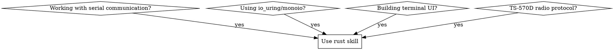

# Rust

## Overview
Expert Rust guidance for serial communication protocols, io_uring async runtime, and terminal UI applications with deep knowledge of RS-232 standards and ratatui framework.

## When to Use


**Use when:**
- Serial port communication with RS-232 protocols
- io_uring integration with monoio runtime
- Terminal UI development with ratatui + crossterm
- Radio control protocols and TTY communication
- Performance-critical async I/O operations

## Core Patterns

### Serial Communication with RS-232

```rust
use std::os::fd::AsRawFd;
use thiserror::Error;
use tokio_serial::{SerialPortBuilder, SerialPort};

#[derive(Error, Debug)]
pub enum SerialError {
    #[error("Invalid baud rate: {0}")]
    InvalidBaudRate(u32),
    #[error("Configuration failed: {0}")]
    ConfigurationFailed(String),
    #[error("IO error: {0}")]
    Io(#[from] std::io::Error),
    #[error("Timeout occurred")]
    Timeout,
}

#[derive(Debug, Clone)]
pub struct SerialConfig {
    pub baud_rate: u32,
    pub data_bits: DataBits,
    pub stop_bits: StopBits,
    pub parity: Parity,
    pub flow_control: FlowControl,
    pub timeout: Duration,
}

pub struct SerialPort {
    port: Box<dyn SerialPort>,
    config: SerialConfig,
}

impl SerialPort {
    pub async fn new(path: &str, config: SerialConfig) -> Result<Self, SerialError> {
        let builder = SerialPortBuilder::new(path, config.baud_rate)
            .data_bits(config.data_bits)
            .stop_bits(config.stop_bits)
            .parity(config.parity)
            .flow_control(config.flow_control)
            .timeout(config.timeout);
            
        let port = builder.open().map_err(|e| SerialError::ConfigurationFailed(e.to_string()))?;
        
        Ok(Self { port, config })
    }
    
    pub async fn write_frame(&mut self, frame: &[u8]) -> Result<(), SerialError> {
        // RS-232 frame writing with proper timing
        self.port.write_all(frame).await?;
        self.port.flush().await?;
        Ok(())
    }
    
    pub async fn read_frame(&mut self, buffer: &mut [u8]) -> Result<usize, SerialError> {
        let mut total_read = 0;
        let start = Instant::now();
        
        while total_read < buffer.len() {
            let remaining = &mut buffer[total_read..];
            match timeout(self.config.timeout, self.port.read(remaining)).await {
                Ok(Ok(0)) => break, // EOF
                Ok(Ok(n)) => total_read += n,
                Ok(Err(e)) => return Err(SerialError::Io(e)),
                Err(_) => return Err(SerialError::Timeout),
            }
            
            if start.elapsed() > self.config.timeout {
                return Err(SerialError::Timeout);
            }
        }
        
        Ok(total_read)
    }
}
```

### io_uring with Monoio Integration

```rust
use monoio::io::{AsyncReadRent, AsyncWriteRent};
use monoio::buf::{IoBuf, IoBufMut};
use std::os::fd::{AsRawFd, RawFd};

pub struct UringSerial {
    fd: RawFd,
    driver: monoio::Driver,
}

impl UringSerial {
    pub fn new(fd: RawFd) -> Result<Self, std::io::Error> {
        let driver = monoio::DriverBuilder::new()
            .enable_all()
            .build()?;
            
        Ok(Self { fd, driver })
    }
    
    pub async fn read<T: IoBufMut>(&self, buf: T) -> (std::io::Result<usize>, T) {
        let mut async_fd = monoio::io::OwnedFd::new(self.fd);
        async_fd.read(buf).await
    }
    
    pub async fn write<T: IoBuf>(&self, buf: T) -> (std::io::Result<usize>, T) {
        let mut async_fd = monoio::io::OwnedFd::new(self.fd);
        async_fd.write(buf).await
    }
    
    pub fn submit_and_wait(&self) -> Result<(), std::io::Error> {
        self.driver.submit_and_wait()
    }
}
```

### Terminal UI with Ratatui

```rust
use ratatui::{
    backend::CrosstermBackend,
    layout::{Constraint, Direction, Layout},
    widgets::{Block, Borders, List, ListItem, Paragraph},
    Frame, Terminal,
};
use crossterm::{
    event::{self, DisableMouseCapture, EnableMouseCapture, Event, KeyCode},
    execute,
    terminal::{disable_raw_mode, enable_raw_mode, EnterAlternateScreen, LeaveAlternateScreen},
};

pub struct RadioApp {
    pub frequency: f64,
    pub mode: String,
    pub signal_strength: u8,
    pub log_entries: Vec<String>,
}

impl RadioApp {
    pub fn new() -> Self {
        Self {
            frequency: 14.230,
            mode: "USB".to_string(),
            signal_strength: 0,
            log_entries: Vec::new(),
        }
    }
    
    pub fn ui(&mut self, f: &mut Frame) {
        let chunks = Layout::default()
            .direction(Direction::Vertical)
            .constraints([
                Constraint::Length(3),
                Constraint::Min(1),
                Constraint::Length(10),
            ])
            .split(f.size());
            
        // Status bar
        let status = Paragraph::new(format!(
            "TS-570D | {:.3} MHz | {} | S{}",
            self.frequency, self.mode, self.signal_strength
        ))
        .block(Block::default().borders(Borders::ALL));
        f.render_widget(status, chunks[0]);
        
        // Main display area
        let display = Paragraph::new("Radio Control Interface")
            .block(Block::default().borders(Borders::ALL));
        f.render_widget(display, chunks[1]);
        
        // Log area
        let log_items: Vec<ListItem> = self.log_entries
            .iter()
            .rev()
            .take(8)
            .map(|entry| ListItem::new(entry.clone()))
            .collect();
            
        let log = List::new(log_items)
            .block(Block::default().title("Log").borders(Borders::ALL));
        f.render_widget(log, chunks[2]);
    }
    
    pub fn handle_key(&mut self, key: KeyCode) -> Result<(), std::io::Error> {
        match key {
            KeyCode::Up => {
                self.frequency += 0.001;
                self.log_entries.push(format!("Frequency: {:.3}", self.frequency));
            }
            KeyCode::Down => {
                self.frequency -= 0.001;
                self.log_entries.push(format!("Frequency: {:.3}", self.frequency));
            }
            KeyCode::Char('m') => {
                self.mode = match self.mode.as_str() {
                    "USB" => "LSB",
                    "LSB" => "AM",
                    "AM" => "FM",
                    _ => "USB",
                };
                self.log_entries.push(format!("Mode: {}", self.mode));
            }
            _ => {}
        }
        Ok(())
    }
}
```

## Quick Reference

| RS-232 Pattern | Implementation |
|----------------|---------------|
| Baud rates | 300, 1200, 2400, 4800, 9600, 19200, 38400, 57600, 115200 |
| Data bits | 7, 8 |
| Stop bits | 1, 2 |
| Parity | None, Even, Odd |
| Flow control | None, Hardware, Software |

| io_uring Operation | Monoio Equivalent |
|---------------------|-------------------|
| IORING_OP_READ | AsyncReadRent::read |
| IORING_OP_WRITE | AsyncWriteRent::write |
| IORING_OP_FSYNC | AsyncFdExt::sync_all |
| IORING_OP_POLL_ADD | Reactor::register |

| Ratatui Component | Usage |
|-------------------|-------|
| Backend | CrosstermBackend |
| Layout | Vertical/Horizontal constraints |
| Widgets | Block, Paragraph, List, Gauge |
| Events | crossterm::event |

## Common Mistakes

### Serial Communication
```rust
// ❌ Blocking I/O in async context
let port = serialport::new("/dev/ttyUSB0", 115200).open().unwrap();
let data = port.read(&mut buffer); // Blocking!

// ✅ Async with tokio-serial or custom io_uring
let mut port = AsyncSerialPort::new("/dev/ttyUSB0", 115200).await?;
let data = port.read(&mut buffer).await?;
```

### Error Handling
```rust
// ❌ Generic error handling
pub fn send_command(&mut self, cmd: &str) -> Result<(), std::io::Error> {
    // No specific error context
}

// ✅ Structured errors with thiserror
#[derive(Error, Debug)]
pub enum RadioError {
    #[error("Invalid command format: {0}")]
    InvalidCommand(String),
    #[error("Serial communication failed: {0}")]
    Serial(#[from] SerialError),
    #[error("Radio not responding")]
    NoResponse,
}
```

### Memory Management
```rust
// ❌ Unnecessary allocations
pub struct SerialPort {
    port_name: String, // Owned string when &str would work
}

// ✅ Efficient memory usage
pub struct SerialPort<'a> {
    port_name: &'a str, // Borrowed when lifetime is clear
    config: SerialConfig,
}
```

## TS-570D Protocol Integration

```rust
#[derive(Debug, Clone)]
pub enum KenwoodCommand {
    SetFrequency(f64),
    GetFrequency,
    SetMode(RadioMode),
    GetMode,
    ReadSignalStrength,
}

#[derive(Debug, Clone)]
pub enum RadioMode {
    USB,
    LSB,
    AM,
    FM,
    CW,
}

impl KenwoodCommand {
    pub fn to_bytes(&self) -> Vec<u8> {
        match self {
            Self::SetFrequency(freq) => {
                format!("F{:.3}\r\n", freq).into_bytes()
            }
            Self::GetFrequency => b"IF?\r\n".to_vec(),
            Self::SetMode(mode) => {
                let mode_str = match mode {
                    RadioMode::USB => "U1",
                    RadioMode::LSB => "L1",
                    RadioMode::AM => "AM",
                    RadioMode::FM => "FM",
                    RadioMode::CW => "CW",
                };
                format!("MD {}\r\n", mode_str).into_bytes()
            }
            Self::GetMode => b"MD?\r\n".to_vec(),
            Self::ReadSignalStrength => b"SM?\r\n".to_vec(),
        }
    }
    
    pub fn parse_response(response: &[u8]) -> Result<Self, RadioError> {
        let response_str = std::str::from_utf8(response)
            .map_err(|_| RadioError::InvalidCommand("Invalid UTF-8 response".to_string()))?;
            
        if response_str.starts_with("IF") {
            // Parse frequency response
            let freq_part = &response_str[2..].trim();
            let freq: f64 = freq_part.parse()
                .map_err(|_| RadioError::InvalidCommand("Invalid frequency".to_string()))?;
            Ok(Self::GetFrequency)
        } else {
            Err(RadioError::InvalidCommand("Unknown response".to_string()))
        }
    }
}
```

Focus on zero-copy operations, proper async patterns, and robust error handling when working with RS-232 and io_uring in Rust.