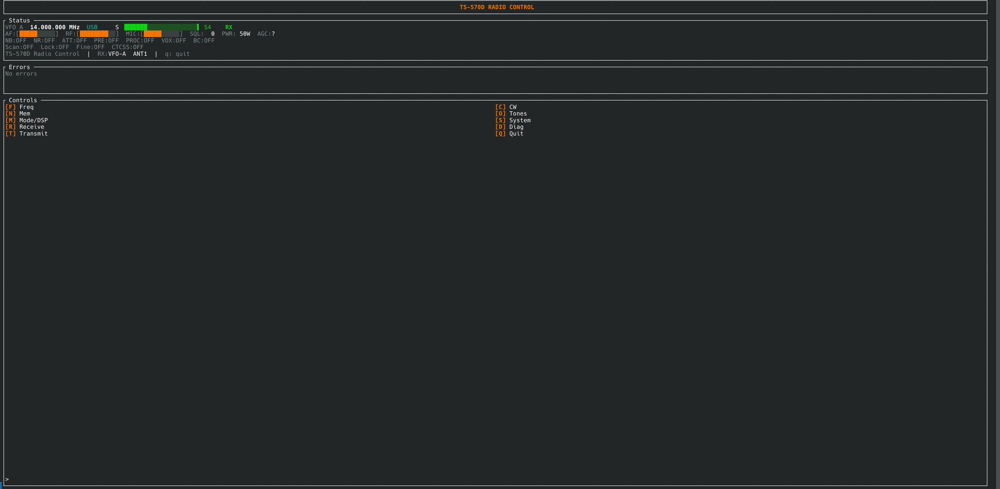

# Kenwood TS-570D Radio Control

Terminal-based CAT control for the Kenwood TS-570D/S HF transceiver. Built with Rust, using io_uring for serial I/O and ratatui for the TUI.



## Requirements

- Linux kernel 5.1+ (io_uring)
- Kenwood TS-570D or TS-570S
- RS-232C serial connection (or USB-serial adapter)
- Serial port access (`dialout` group membership, or root)

## Installation

### Debian/Ubuntu package

Download the latest `.deb` from the releases page and install:

```sh
sudo dpkg -i ts570d-radio-control_<version>_amd64.deb
```

Installs three binaries to `/usr/bin/`:

| Binary | Description |
|--------|-------------|
| `ts570d-control` | Main control application |
| `ts570d-emulator` | Virtual radio emulator |
| `rs232c-pintest` | RS-232C wiring/pin diagnostic |

### Build from source

```sh
cargo build --release        # ts570d and pin-test
cargo build --release -p emulator
```

Binaries are placed in `target/release/` as `ts570d`, `emulator`, and `pin-test`.

## Usage

```sh
ts570d-control --port /dev/ttyS0
```

Full options:

```
Usage: ts570d-control --port <path> [--baud <rate>] [--stop-bits <n>]

  --port      Serial port path (required)
  --baud      Baud rate: 1200, 2400, 4800, 9600  (default: 9600)
  --stop-bits Stop bits: 1 or 2                  (default: 1)
```

The TS-570D factory default is 9600 baud, 8N1. If your radio has been configured differently, pass `--baud` and `--stop-bits` accordingly.

### Key bindings

| Key | Action |
|-----|--------|
| `F` | Frequency menu |
| `N` | Memory channel menu |
| `M` | Mode / DSP menu |
| `R` | Receive settings |
| `T` | Transmit settings |
| `C` | CW keyer settings |
| `O` | Tones (CTCSS/tone squelch) |
| `S` | System settings |
| `D` | Diagnostics (runs 99 CAT command round-trips) |
| `Q` | Quit |

## Emulator

A built-in emulator lets you run the control program without a physical radio. See [docs/emulator.md](docs/emulator.md) for details.

## Protocol

CAT command reference: Kenwood TS-570D instruction manual, pages 70–81.
PDF: <https://www.kenwood.com/usa/Support/pdf/TS-570-English.pdf>

## License

Copyright 2026 Matt Franklin. Licensed under the [Apache License, Version 2.0](LICENSE.txt).
