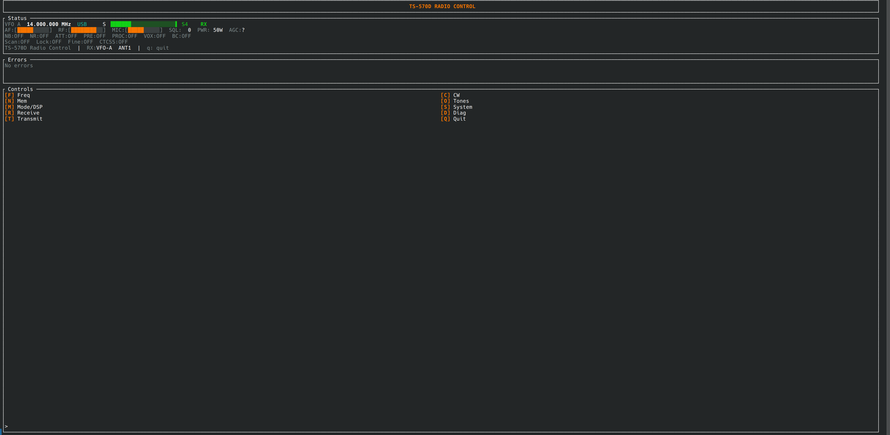

# Kenwood TS-570D Radio Control

Terminal-based CAT control for the Kenwood TS-570D/S HF transceiver. Built with Rust, using io_uring for serial I/O on Linux (native Win32 COM-port I/O on Windows) and ratatui for the TUI.



## Requirements

- **Linux**: kernel 5.1+ (io_uring), serial port access (`dialout` group membership, or root)
- **Windows**: 64-bit Windows with a COM port (native or USB-serial adapter) — see [Windows support](#windows-support) below
- Kenwood TS-570D or TS-570S, or a remote `ts570d server` instance (see [Network modes](#network-modes))
- RS-232C serial connection (or USB-serial adapter)

## Installation

### Debian/Ubuntu package

Download the latest `.deb` from the releases page and install:

```sh
sudo dpkg -i ts570d-radio-control_<version>_amd64.deb
```

Installs three binaries to `/usr/bin/`:

| Binary | Description |
|--------|-------------|
| `ts570d-control` | Main control application |
| `ts570d-emulator` | Virtual radio emulator |
| `rs232c-pintest` | RS-232C wiring/pin diagnostic |

### Windows

Download the latest `ts570d-radio-control_<version>_windows-x86_64.zip` from
the releases page and extract it. It contains `ts570d.exe`, `pin-test.exe`,
`README.md`, and `LICENSE.txt` — no installer, just run `ts570d.exe` from a
terminal (PowerShell or Command Prompt). See [Windows support](#windows-support).

### Build from source

```sh
cargo build --release        # ts570d and pin-test
cargo build --release -p emulator
```

Binaries are placed in `target/release/` as `ts570d`, `emulator`, and `pin-test`.

## Usage

```sh
ts570d-control --port /dev/ttyS0
```

Full options:

```
Usage: ts570d-control --port <path> [--baud <rate>] [--stop-bits <n>]

  --port      Serial port path (required, mutually exclusive with --server)
              Examples: /dev/ttyS0  /dev/ttyUSB0  COM3
  --baud      Baud rate: 1200, 2400, 4800, 9600  (default: 9600)
  --stop-bits Stop bits: 1 or 2                  (default: 1)

Usage: ts570d-control --server <host:port>

  --server    Connect to a remote `ts570d server` instance's raw TCP
              listener instead of opening a local serial port (mutually
              exclusive with --port/--baud/--stop-bits).
              Example: --server 127.0.0.1:7373
```

The TS-570D factory default is 9600 baud, 8N1. If your radio has been configured differently, pass `--baud` and `--stop-bits` accordingly.

### Key bindings

| Key | Action |
|-----|--------|
| `F` | Frequency menu |
| `N` | Memory channel menu |
| `M` | Mode / DSP menu |
| `R` | Receive settings |
| `T` | Transmit settings |
| `C` | CW keyer settings |
| `O` | Tones (CTCSS/tone squelch) |
| `S` | System settings |
| `D` | Diagnostics (runs 99 CAT command round-trips) |
| `Q` | Quit |

## Emulator

A built-in emulator lets you run the control program without a physical radio. See [docs/emulator.md](docs/emulator.md) for details. The emulator is Linux/Unix-only (it hosts a pseudo-terminal pair) — it does not build or run on Windows.

## Network modes

### Headless server mode

`ts570d server` runs the control program without a TUI: one process owns the
physical serial port and exposes it to the network, so multiple remote
clients (this application's own `--server` mode, WSJT-X, or any
`radio-cat-rs`-aware client) can share one radio connection.

```
Usage: ts570d server --port <serial-port-path> [--baud <rate>] [--stop-bits <n>]
             [--raw-tcp-port <port>] [--raw-udp-port <port>] [--rigctl-port <port>]

  --raw-tcp-port  Bind cat-server's raw length-prefixed TCP protocol
  --raw-udp-port  Bind cat-server's raw enveloped UDP protocol
  --rigctl-port   Bind a Hamlib rigctld-compatible TCP listener
                  (for WSJT-X's "Hamlib NET rigctl" rig type)
```

At least one of the three listener flags is required.

**Windows note:** `--raw-tcp-port`/`--raw-udp-port` work today on Windows.
`--rigctl-port` does not yet — `radio-cat-rs`'s `cat-rigctl` crate (which
implements the Hamlib bridge) has no Windows backend upstream yet. It is
rejected with a clear error rather than silently ignored. See
[docs/adr/0006-windows-concurrency-model.md](docs/adr/0006-windows-concurrency-model.md)'s
Task 5 cross-reference.

### Remote client mode

`ts570d-control --server <host:port>` connects the normal TUI to a remote
`ts570d server` instance's raw TCP listener instead of a local serial port —
useful for controlling a radio connected to a different machine:

```sh
# On the machine with the radio attached:
ts570d server --port /dev/ttyUSB0 --raw-tcp-port 7373

# On any machine on the network:
ts570d-control --server radio-host:7373
```

Works on both Linux and Windows.

## Windows support

Windows is a supported target (`x86_64-pc-windows-gnu`/`-msvc`) for
`ts570d.exe`: local serial (native Win32 COM-port I/O), `--server` remote
client mode, and headless server mode (raw TCP/UDP; `--rigctl-port` pending
an upstream `cat-rigctl` Windows backend — see above). The `emulator` and
`pin-test` diagnostic tool have no Windows-specific concerns of their own
(`pin-test` is fully cross-platform; `emulator` is Linux/Unix-only by
design, per above).

This repo has no Windows machine to test against directly — Windows builds
are verified with `cargo check --target x86_64-pc-windows-gnu` (type-check
only) plus the CI `windows-check` job; real hardware/runtime validation
happens on the release workflow's actual `windows-latest` build and,
ultimately, by users running the released binary. See
[docs/adr/0006-windows-concurrency-model.md](docs/adr/0006-windows-concurrency-model.md)
for the concurrency-model design and its documented residual risk.

## Architecture

The generic, radio-independent CAT engine and transport layer live in the
sibling library [`radio-cat-rs`](https://github.com/kf0uwv/radio-cat-rs)
(`cat-framework`, `cat-client`, `cat-transport-core`, `cat-transport-serial`
— consumed as git dependencies), with all TS-570D specifics isolated in this
repo's own crates:

| Crate | Responsibility |
|-------|----------------|
| `cat-framework` (external) | Generic CAT engine (command table, parser, dispatch, response builder). No radio-specific types. |
| `cat-transport-serial` (external) | io_uring RS-232 transport on Linux, native Win32 COM-port transport on Windows (implements `Transport`/`CatSession`). |
| `radio` | TS-570D command table, `CatRadio` state machine, controller client (`Ts570d<S: CatSession>`), `Radio` trait + domain types. |
| `ui` | Ratatui terminal interface (depends on `radio` only). |
| `emulator` | Virtual radio; runs `CatFramework<Ts570dRadio>`. |

A single `TS570D_COMMAND_TABLE` backs both the controller and the emulator.
The design — dependency graph, command-processing sequence, extraction
boundary, network-transport readiness, and how a second radio (`ft991a`,
Yaesu FT-991A) implements the generic traits — is recorded as
[ADRs](docs/adr/), both here and in `radio-cat-rs`'s own `docs/adr/`.

## Protocol

CAT command reference: Kenwood TS-570D instruction manual, pages 70–81.
PDF: <https://www.kenwood.com/usa/Support/pdf/TS-570-English.pdf>

## License

Copyright 2026 Matt Franklin. Licensed under the [Apache License, Version 2.0](LICENSE.txt).
