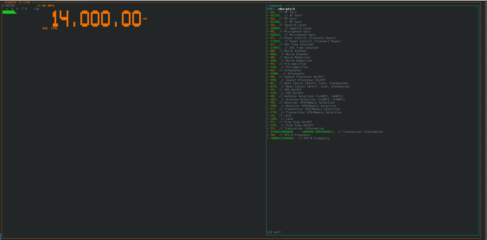

# TS-570D Emulator

The emulator provides a virtual Kenwood TS-570D that speaks the full CAT protocol over a pseudo-terminal (PTY) pair. It lets you develop, test, and demo the control program without a physical radio.



## Running

```sh
ts570d-emulator
```

The emulator creates a PTY pair and prints the slave device path (e.g. `/dev/pts/4`) to the header bar. Point `ts570d-control` at that path:

```sh
ts570d-control /dev/pts/4
```

## Interface

The emulator TUI has two panels:

**Left — Radio display**
- S-meter bar with calibrated tick marks (S1–S9, +20 dB)
- Large LED-style frequency readout (MHz, 10 Hz resolution)
- Mode indicator (USB, LSB, CW, FM, AM, FSK)
- Status flags: RX/TX, ANT1/ANT2, CTRL

**Right — Command log**
- Live feed of every CAT command received (`→`) and every response sent (`←`)
- Command annotations showing the operation name and parameter meaning

## Supported commands

The emulator implements all CAT commands in the TS-570D manual (pages 70–81):

| Category | Commands |
|----------|----------|
| Frequency | FA, FB, IF |
| Mode | MD |
| VFO/Memory | FR, FT, MC, MR, MW |
| Meters | SM, RM |
| Gain | AG, RG, MG |
| Squelch | SQ |
| Power | PC, PS |
| Noise | NB, NR |
| Filters | SH, SL, BC, IS |
| Antenna | AN |
| RIT/XIT | RT, XT, RC, RD, RU |
| Scan | SC |
| Lock | LK, FS |
| VOX | VX, VG, VD |
| Tones | CN, CT, TN, TO |
| CW | KS, PT, SD, CA |
| Speech | PR |
| Preamp/Att | PA, RA |
| AGC | GT |
| Misc | BY, ID |

SET commands update emulator state immediately; subsequent query commands reflect the new state.

## Notes

- The emulator is intended for development and testing only — it does not model RF behaviour, propagation, or audio
- PTY is torn down when the emulator exits; the control program will disconnect cleanly
- Press `q` in the emulator window to quit
