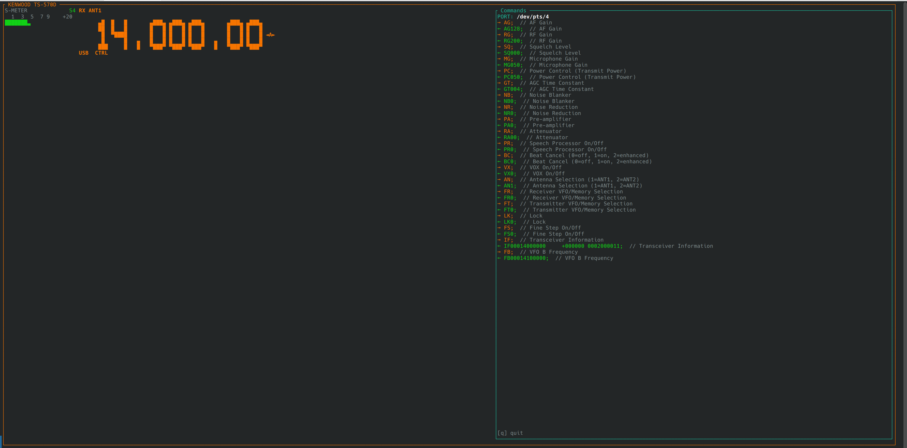

# TS-570D Emulator

The emulator provides a virtual Kenwood TS-570D that speaks the full CAT protocol over a pseudo-terminal (PTY) pair. It lets you develop, test, and demo the control program without a physical radio.



## Running

```sh
ts570d-emulator
```

The emulator creates a PTY pair and prints the slave device path (e.g. `/dev/pts/4`) to the header bar. Point `ts570d-control` at that path:

```sh
ts570d-control --port /dev/pts/4
```

## Virtual devices

The emulator is a **radio**, not a server. It presents the interfaces a
TS-570D presents, and the control program connects to them exactly as it
would to the real thing:

| device | how |
|---|---|
| CAT serial | a PTY, path printed as `PTY_SLAVE=…` |
| CN4 IF tap | `--cn4 <addr>`, an RTL-SDR over `rtl_tcp`, printed as `CN4_TAP=…` |

```sh
ts570d-emulator --cn4 127.0.0.1:1234
```

An earlier version served the console's own network protocol directly.
That was the wrong layer: it put the radio and the server in one box and
made the control program unnecessary to test anything. The control program
is the thing that owns a radio and serves consoles.

### The CN4 tap is an RTL-SDR

It speaks `rtl_tcp` — librtlsdr's own protocol — so a virtual tap, a real
dongle and an actual `rtl_tcp` server are interchangeable to everything
downstream. The FFT, the windowing and the inversion correction all run for
real against it.

**The IQ is mirrored**, because that is what comes off CN4: a TS-570D's LO1
is high-side, so its tapped spectrum arrives reversed. A tap that served
un-mirrored IQ would make the control program's correction cancel a
distortion that was never applied — right on the bench and wrong the moment
real hardware appeared.

**The window follows the dial.** The SDR is parked on the 73.05 MHz first
IF and the radio's local oscillator does the tuning, so retuning over CAT
moves the window. That is the property a console's click-to-tune depends
on.

### Synthetic signals

Five kinds, with genuinely different shapes:

| | width | behaviour |
|---|---|---|
| CW | ~100 Hz | keys on and off at sending speed |
| Digital | ~50 Hz | 15-second slots, hard edges, FT8-shaped |
| SSB | ~2.6 kHz | leans to its sideband, restless |
| AM | ~6 kHz | carrier plus two symmetric sidebands |
| Noise | ~20 kHz | flat and wide — deliberately *not* a signal |

They live at absolute frequencies and are crowded into the HF amateur
bands, with the space between them close to empty: a console that only
ever sees busy spectrum is never tested against a quiet band. Density is
about one signal per 8 kHz of window, which leaves each one its own shape.

`--seed <n>` chooses the band. The same seed gives the same signals in the
same places every run, so "the carrier that was here yesterday" is a useful
thing to say while debugging a console.

### Not yet

**ACC2** — the audio path and the DTR PTT line. DTR is already real (it is
a PTY modem line); the audio is not emulated yet.

## Interface## Interface

The emulator TUI has two panels:

**Left — Radio display**
- S-meter bar with calibrated tick marks (S1–S9, +20 dB)
- Large LED-style frequency readout (MHz, 10 Hz resolution)
- Mode indicator (USB, LSB, CW, FM, AM, FSK)
- Status flags: RX/TX, ANT1/ANT2, CTRL

**Right — Command log**
- Live feed of every CAT command received (`→`) and every response sent (`←`)
- Command annotations showing the operation name and parameter meaning

## Supported commands

The emulator implements the following CAT commands from the TS-570D manual (pages 70–81):

| Category | Commands |
|----------|----------|
| Frequency | FA, FB, IF |
| Mode | MD |
| VFO/Memory | FR, FT, MC, MR, MW |
| Tuning steps | DN, UP |
| Meters | SM, RM |
| Gain | AG, RG, MG |
| Squelch | SQ |
| Power | PC, PS |
| TX/RX | TX, RX |
| Noise | NB, NR |
| Filters | SH, SL, BC, IS, FW |
| Antenna | AN, AC |
| RIT/XIT | RT, XT, RC, RD, RU |
| Scan | SC |
| Lock / Step | LK, FS |
| VOX | VX, VG, VD |
| Tones | CN, CT, TN, TO |
| CW | KS, PT, SD, CA, KY |
| Speech | PR, VR, LM, PB |
| Preamp/Att | PA, RA |
| AGC | GT |
| Auto info | AI |
| Menu | EX |
| Misc | BY, ID, FV, SR |

SET commands update emulator state immediately; subsequent query commands reflect the new state.

## Notes

- The emulator is intended for development and testing only — it does not model RF behaviour, propagation, or audio
- PTY is torn down when the emulator exits; the control program will disconnect cleanly
- Press `q` in the emulator window to quit
